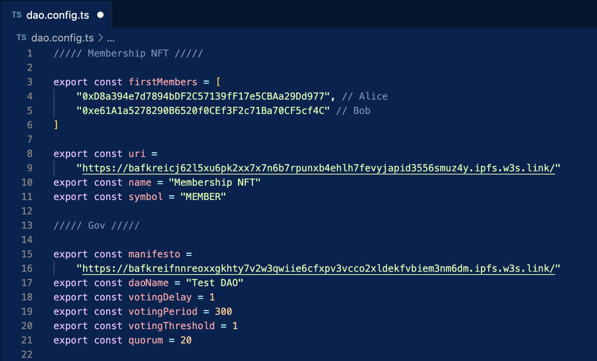

# Deployment

Before you deploy your DAO, you should ask yourself the following questions: 

- What is the objective of your DAO?
- What kind of proposals do you expect?
- Who are the first members? 

## Deploy from UI (Gov Deployer)

No tech required. 

{: .warning }
You can use Gov Deployer but it is currently under development. 

[Deploy your own DAO](https://gov-deployer.netlify.app/){: .btn .btn-purple }

## Deploy manually

### Deploy the Solidity contracts

- Fork [Gov](https://github.com/w3hc/gov)
- Clone the it locally or open in a GitHub codespace 
- Create a `.env` on the model of `.env.template` and add your own keys there
- Edit and upload the membership NFT `metadata` (you will need the CID of this json file)
- Edit and upload the manifesto (you will need the CID of this markdown file)

- In the [`dao.config.file`](https://github.com/w3hc/gov/blob/main/dao.config.ts), select 
- Run this command: `pnpm deploy:sepolia`

Now that your DAO is deployed, you can [add it in Tally](https://www.tally.xyz/add-a-dao) and use their interface (view an example [here](https://www.tally.xyz/gov/web3-hackers-collective)). 

You also can deploy your own interface using Gov UI. 

### Deploy Gov UI

- Fork [gov-ui repo](https://github.com/w3hc/gov-ui)
- Clone it locally
- Create a `.env` on the model of `.env.template` and add your own keys there
- Replace the `Gov.json` and `NFT.json` files in the /utils directory (in the `gov` repo, you can find these two files in the `/deployments` directory)
- Review all the values in `src/utils/config.ts`, for exemple the ERC20 token address may change (for now, only one ERC20 can be selected)
- You can now deploy the web app using Fleek, Netlify, Vercel, or any other 

