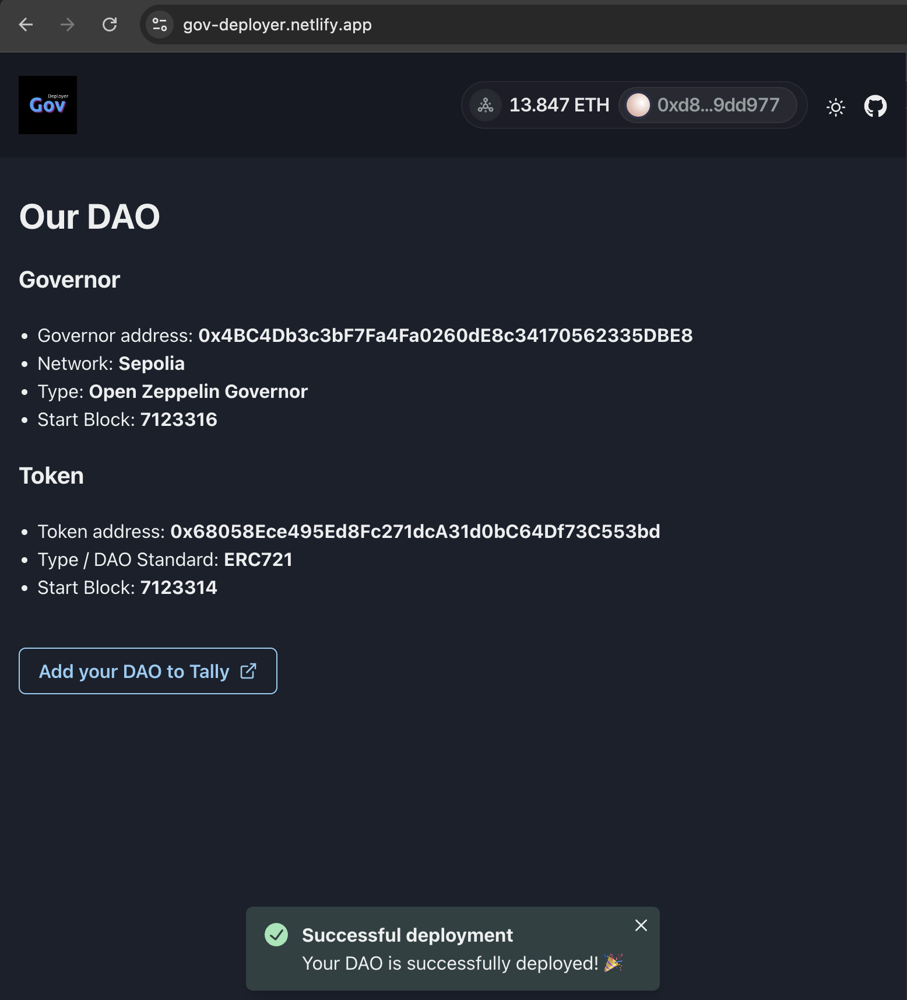

# Welcome! ✨

[Gov](https://github.com/w3hc/gov) is a DAO framework built with Open Zeppelin's Governor contract in combination with NFTs. It provides **a coordination tool that fits the needs of everyday people**.

We're inviting orgs, federations of orgs, activists, neighborhoods, stewards of the commons, collectives, and all communities to create their own DAO. The [Web3 Hackers Collective](https://www.tally.xyz/gov/web3-hackers-collective) has recently released the [v0.10.1](https://github.com/w3hc/gov/releases/tag/v0.10.1) of Gov.

{: .custom }
> We just released a cross-chain variant, your DAO can now be deployed to [all networks](./crosschain.html) at the same address!

The most important to know before you deploy you own DAO is the following: 

1. What is the mission statement of your DAO?
2. Who are the first members?
3. What kind of proposals do you expect? 

You can find the full deployment checklist [here](./deployment.html#checklist), but feel free to reach out to [Julien](https://github.com/julienbrg) on [Farcaster](https://warpcast.com/julien-), [Element](https://matrix.to/#/@julienbrg:matrix.org), [Status](https://status.app/u/iwSACggKBkp1bGllbgM=#zQ3shmh1sbvE6qrGotuyNQB22XU5jTrZ2HFC8bA56d5kTS2fy), [Telegram](https://t.me/julienbrg), [Twitter](https://twitter.com/julienbrg), [Discord](https://discordapp.com/users/julienbrg), or [LinkedIn](https://www.linkedin.com/in/julienberanger/).

## Deploy

[Deploy your own DAO](https://gov-deployer.netlify.app){: .btn .btn-purple target="_blank" }

Gov is fully compatible with [Tally](https://www.tally.xyz/get-started), so right after the deployment you can add it to Tally: 

- Click on `Deploy myself`
- Click on `Deploy contracts yourself`
- Check the three boxes then click `Get Started`
- Paste your Gov contract address 
- You should be good to go! 

And don't forget to **delegate to yourself** before you submit a proposal, otherwise you won't be able to vote. 

## Features

- [DAO membership NFTS (ERC-721)](./#dao-membership-nfts)
- [On-chain voting system (Governor)](./#on-chain-voting-system)
- [Customizable interface with email login](./#customizable-interface-with-email-login)
- [Members vote to add or ban a member](./#members-vote-to-add-or-ban-a-member)
- [Timestamp-based](./#timestamp-based)
- [Easy to config, deploy and run](./#easy-to-config-deploy-and-run)
- [Fully compatible with Tally](./#fully-compatible-with-tally)
- [Extreme composability/modularity](./#extreme-composabilitymodularity)
- [Upgradeable governance settings](./#upgradeable-governance-settings)

### DAO membership NFTS

The membership of your DAO is represented by an NFT. One person, one vote. These NFTs can be viewed as 'membership cards'. They're customizable: you can submit a proposal to modify the metadata of your NFT.

Since `v0.10.0`, these NFTs are non-transferable by default ("SBT"). 

### On-chain voting system

Open Zeppelin's Governor contract defines the voting rules: it allows members to cast a their vote, it counts the votes and execute the proposal if successful.

### Customizable interface with email login

In addition to Tally interface, you can get your own web app (website). The users, members of your DAO, don't need any wallet to submit proposals, vote, delegate their voting power, etc. 

### Members vote to add or ban a member

You can add or ban a member of the DAO by submitting a proposal. 

### Timestamp-based

Gov is timestamp-based by default, as opposed to `blockNumber`-based. 

### Easy to config, deploy and run

Gov is one of the easiest existing way to launch a secure and scalable DAO. 

### Fully compatible with Tally

You can use [Tally](https://www.tally.xyz/) to monitor your DAO, submit proposal and vote. 

### Extreme composability/modularity

The Governor contract allows us to trigger custom on-chain actions. When you deploy a Solidity contract and transfer its ownership to the Gov, the DAO is the only entity allowed to interact with functions marked `onlyOwner`. The [plugins](./plugins.html) are optional functionalities you can add to your DAO.

### Upgradeable governance settings

You can upgrade the voting parameters by a community vote. Learn more about the [vote settings](./vote-settings.html).

## Supported networks

### Mainnets

- [Optimism](https://docs.optimism.io/chain/networks#op-mainnet)
- [Arbitrum](https://docs.arbitrum.io/welcome/get-started)
- [Base](https://docs.base.org/docs/network-information#base-mainnet)

### Testnets

- [Sepolia](https://ethereum.org/nb/developers/docs/networks/#sepolia)
- [OP Sepolia](https://docs.optimism.io/chain/networks#op-sepolia)
- [Arbitrum Sepolia](https://docs.arbitrum.io/welcome/get-started)
- [Base Sepolia](https://docs.base.org/docs/network-information/#base-testnet-sepolia)

## Github repositories

- [gov](https://github.com/w3hc/gov): Solidity contracts, including the cross-chain variant
- [gov-ui](https://github.com/w3hc/gov-ui): Next.js interface to interact with the Solidity contracts
- [gov-deployer](https://github.com/w3hc/gov-deployer): Allows anyone to deploy a DAO
- [gov-docs](https://github.com/w3hc/gov-docs): Technical documentation
- [gov-saas](https://github.com/w3hc/gov-saas): Next.js interface (alternative to [gov-ui](https://github.com/w3hc/gov-ui))
- [gov-api](https://github.com/w3hc/gov-api): Nest-js API to automatize execution and sync across networks
